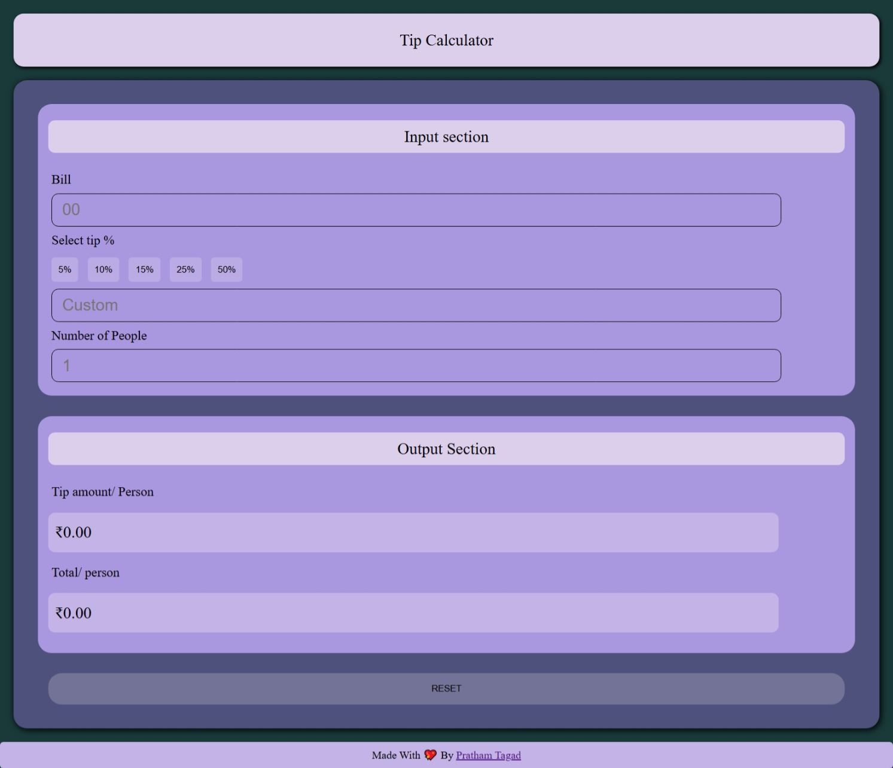

# 💸 Interactive Tip Calculator

An intuitive and beautifully designed Tip Calculator to help you split bills with ease! Whether you're dining out with friends or just want to quickly calculate tips, this app has your back. 😎

🔗 **Live Preview**: [interactive-tip-calculator.netlify.app](https://interactive-tip-calculator.netlify.app/)

---

## 🖼️ Preview



---

## 🚀 Features

- 💰 Calculates tip amount per person
- 👥 Split bill among multiple people
- 🔘 Choose predefined tip % (5%, 10%, 15%, 25%, 50%) or enter a custom value
- 🌗 Clean, responsive, and elegant UI
- 🔁 Reset all values with one click
- ⚡️ Instant result updates as you type

---

## 🛠️ Tech Stack

| Technology | Percentage Used |
|------------|------------------|
| 🌐 HTML     | `35.0%`           |
| 🎨 CSS      | `29.7%`           |
| ⚙️ JavaScript | `35.3%`         |

---

## 📦 Getting Started

You can get a local copy up and running in just a few steps:

### 🔄 Clone this repository

```bash
git clone https://github.com/your-username/Interactive-Tip-Calculator.git
cd Interactive-Tip-Calculator
